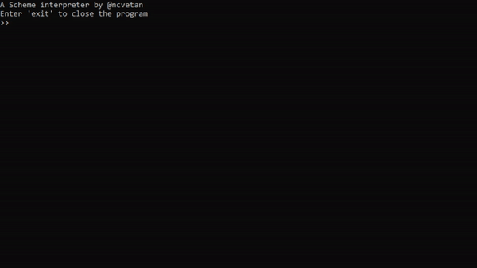

# A Scheme Interpreter

An implementation of the Scheme language writtin in C++!

This project produces two executables when built...

**scheme.exe:** a read-eval-print loop, allowing users to directly input Scheme code line-by-line, which will be evaluated and printed to the console



**tests_schemelang.exe:** runs a series of tests for the language, ensuring that any changes made do not affect expected behaviour

# Installation:

This project is built using CMake. With CMake installed, you can run the following commands to build the program.

```
mkdir build
cd build
cmake <path to project's root directory>
cmake --build .
```

# Future Additions:

- Support for a wider range of standard Scheme procedures
- Ability to pass Scheme file to scheme.exe, allowing files to be evaluated
- More test coverage
